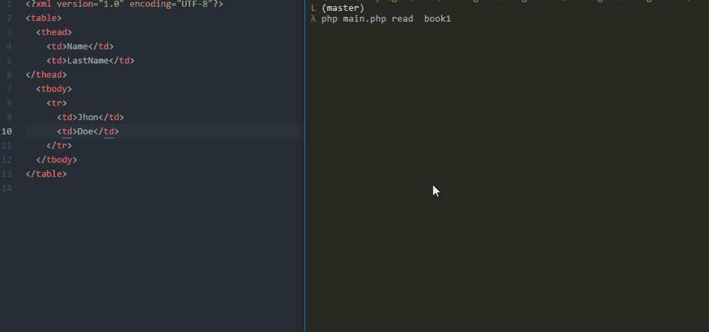
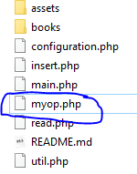
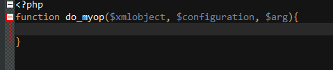

# XML ADDRESS BOOK




> **NOTE**: Books are located in ./books/ path.


**Features**

- Insert new column name
- Insert new data rows 
- Read a XML Book

**Requirements**

* PHP 7.x.x

**MAIN USAGE**

`php main.php[insert|read][row|col]<bookName>[data...]` 

##### ADD NEW COLUMN NAME

```
php main.php insert col <bookname> column1 column2 column3 column4 ...
```

##### ADD NEW DATA ROW

```
php main.php insert row <bookname> data1 data2 data3 data4 ...
```

##### READ XML ADDRESS BOOK

```
php main.php read <bookname>
```

### Extending

```php
<?php
/**configuration.php*/
return [...,
        "allowed" => ["insert","read"],
        "insertions" => ["row", "col"]
       ];
```

To extend with new operations, add a new item at "allowed" index Then create a new php file named as the new item added:  "myop.php" :

```php
    "allowed" => ["insert","read", "myop"]
```


Now define a new function like the following inside your new php file:




:p Have fun!
