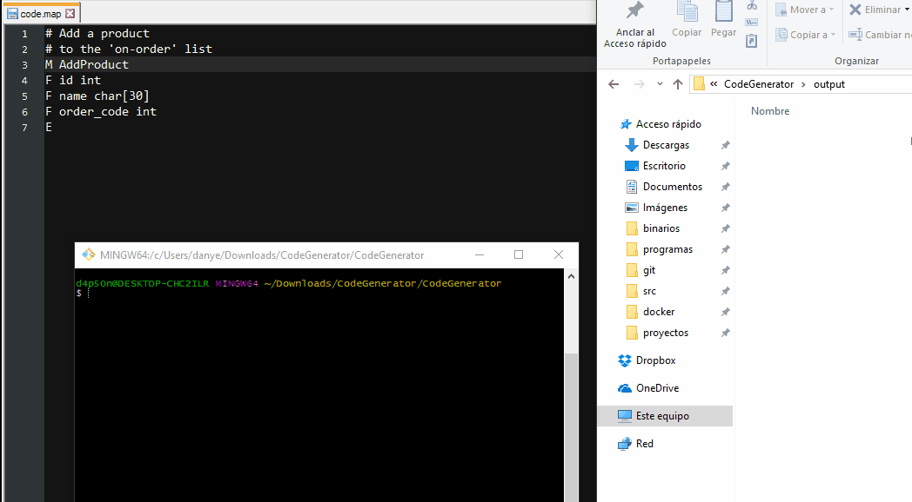

# MY CODE GENERATOR




### Requirements

* perl 5.6 or greater

### Description

Takes a file with mnemonics  and turns its content into any programming language(if is supported as a generator).  

> **Note**: Each mnemonic file should has a *.map* extension

### Supported features

| MNEMONIC | DESCRIPTION      |     PASCAL     |       C        |
| -------- | ---------------- | :------------: | :------------: |
| #        | Comment line     | Single comment | Single comment |
| M        | Structure's name |     Record     |     Struct     |
| F        | Field definition |  field/array   |  field/array   |
| E        | End of entity    |       NA       |       NA       |
|          |                  |                |                |


### Usage

```sh
./run.sh ./ouput/folder/ ./input/folder/with/map/files/
```

| Description                              | example              |
| ---------------------------------------- | -------------------- |
| Making a comment                         | \# this is a comment |
| Defining a structure                     | M your_name_here     |
| Defining a field (attribute)             | F name type          |
| Defining an array f any type with name   | F name type[n]       |
| End of entity(structure, class, record,...) | E End of entity      |

> **Note**: the type is relative to the language that will be converted to. If you need to define your own set of types, then see the extending section.


### Extending

#### Adding new generators

1. Extend from App::CodeGenerator::Interfaces::AbstractLang;


2. Implement each required procedure inside AbstractLang class.
3. Save your code generator as a pascal module in App::CodeGenerator::Generators::YOUR_GENERATOR_NAME;
4. You can get more help reading the pascal code generator in *App::CodeGenerator::Generators::Pascal*
5. To save a generated line, just push to:

```
	push @{$self->{lines}}, "your translation" ;
```

 

#### Supporting new mnemonics

In  App::CodeGenerator::Map.pm file you can find the following bounch of lines starting at line 9:

```
 map =>  {
      Langs => qr/^\s*Langs\s*(?:([\w,]+)?)/,
      SingleComment => qr/^\s*#\s*(.*?)\S*$/,
      Field => qr/^\s*F\s+(\w+)\s+(\w+)(?:\[(\d+)\])?\s*$/,
      Class_ => qr/^\s*M\s+(\w+)/,
      EndOfClass => qr/^\s*E\s*/
}
```

Add a new regex with a unique key to identify the token group. Then just go to App::CodeGenerator::Interfaces::AbstractLang file  and inside "update" subroutine add a conditional to call the method handler for your new token key, to finish add a mandatory subroutine just like the following:

```
sub doYourNewToken{
	my $self = shift;
	die "You cannot create an instance of me directly\n";
};
```


### TODO

* Error Handling
* Improve this documentation
* add new mnemonics
* load dinamically what generator will be used
