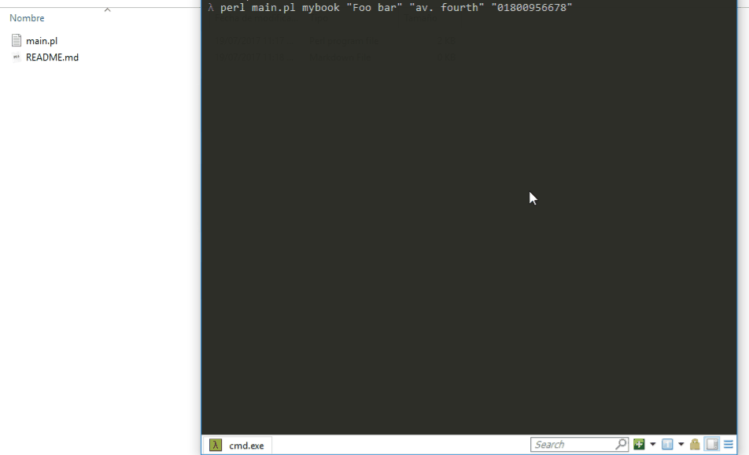

# Binary Address Book

This is an Address Book for fun and profit... just kidding, this perl script is for fun only and pretends to demonstrate the level of work required to build a simple a registry like the most used "database managers"  do.  

The output of the script is a binary file which contains a set of rows and columns.  For now it's supported only insertions for 3 cols:

* name
* lastname
* phone number

#### **usage**

```
perl main.pl [tableName] [contact's name] [Contact's lastname] [Contact's phone]
```


:p have fun