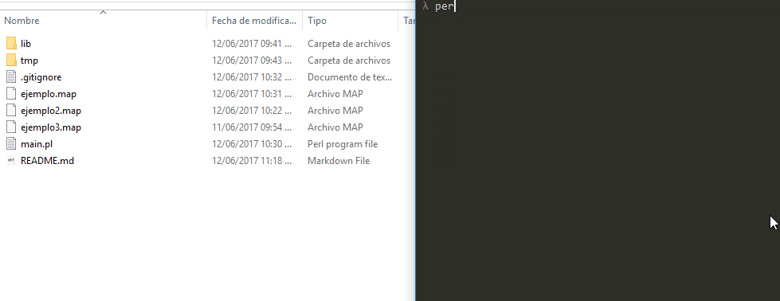

# DOMAIN LANGUAGE EXERCISE

This script takes a set of  "Mnemonics" and generates a python code  which draws a shape  using "turtle graphics" engine. 


> The idea is originally taken from the book "The pragmatic programmer", chapter 2 , topic 12, page 63.



### Requirements

- Python 3.6 or higher 
- Perl 5.0 or higher


**Usage:**

```perl
perl main.pl ejemplo.map
```


**Commands:**

| Command |   Arg type    |                decription                |
| :-----: | :-----------: | :--------------------------------------: |
|    P    |      int      |                 Pen Size                 |
|    D    |     null      |        draw the motion of the pen        |
|  COLOR  | String String | String1 the border color & String2 the inner color of the shape |
|    W    |      int      |          move to west  n pixels          |
|    N    |      int      |          move to north n pixels          |
|    E    |      int      |          move to east n pixels           |
|    S    |      int      |          move to south n pixels          |
|    U    |     null      |    do not draw the motion of the pen     |


**Example of map file:**

```bash
P 2 # select pen 2
D   # pen down
COLOR blue yellow # line blue filled with yellow
W 2 # draw west 2cm
N 1 #then north 1
N 10 #then north 10
E 2 #then EASTH 2
S 1 #then back south
U   # pen up
```

**Notes:** 

* Comments are optional.
* 1 the scale of pixel drawing is : 1 * 100 


**Contact me:**

If you have questions or you want to improve the code make a pull request or say hi to danyelmorales1991@gmail.com


:) Regards.