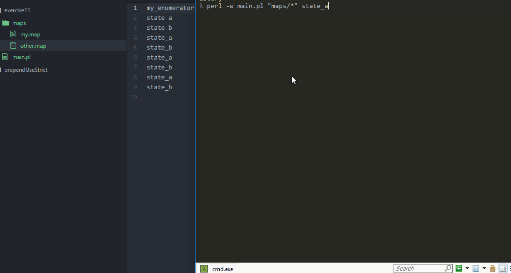

# C ENUM GENERATOR



Takes a map file and generates a  C enumerator. The first line of the map is used for:

1.  the enumerator's name, 
2. output directory's name
3. the .h C code file's name
4. the .c C code file's name

### usage

 `perl -w main.pl "maps/*" `

### Example

**my.map file**

```
NAME
state_a
state_b
```


**NAME.c** 

```
const char* NAME_names[] = 
{
	"state_a",
	"state_b",
};
```

**NAME.h**

```
extern const char* NAME_names[];
typedef enum {
	state_a,
	state_b,
}NAME;
```


Have fun!