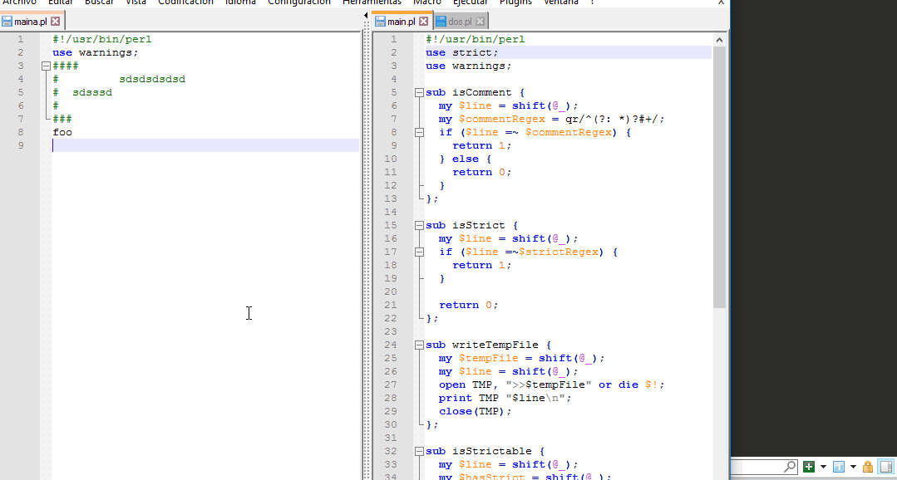

# Prepends USE STRICT;

The current perl script read the files from a directory and verify each file to contain the "use strict;" package otherwise the *"use strict"* statement is prepended always after the first comment block of the file (if exists any).



#### usage:

the argumento 0 should contain a glob regex pattern which is used to read the files to verify.

```
perl main.pl "./path/to/directory/*"
```

